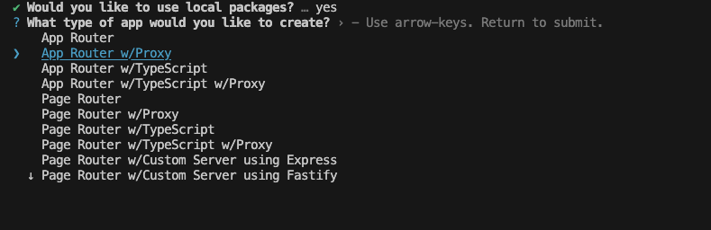
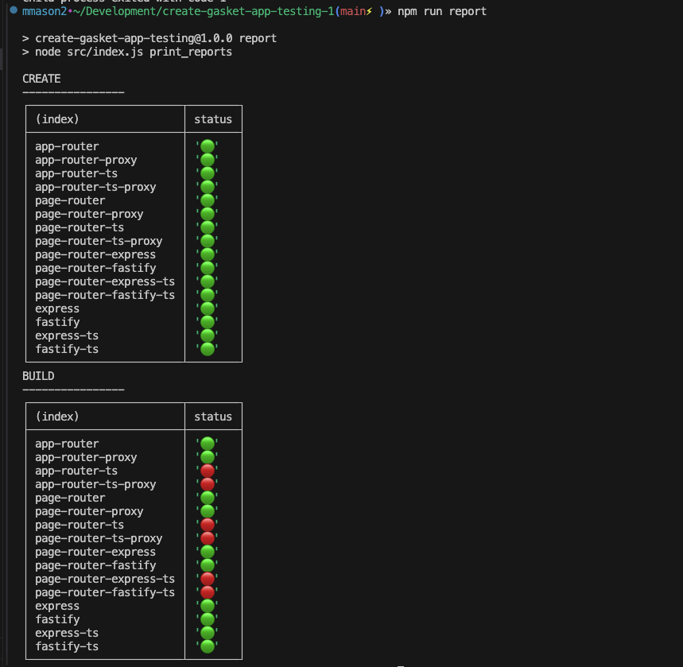

# Create Gasket App Testing

This is a utility to test the create-gasket-app CLI.

## Getting Started

```sh
git clone <repo>
cd <repo>
npm install
```

## Usage

```sh
npm run start // or node src/index.js
```


## Apps

Apps are created in the `__apps__` directory.

## Local Presets

Create a `.env` file in the root of the project with the following:

```sh
NEXTJS_PRESET_PATH=path
API_PRESET_PATH=path
BUILD_APPS=1 # Build the apps post create
```

## Reports

All reports on untracked and they are in progress. Reports are populated after running the utility. Errors are captured and the stack trace is printed to the `error` property of the app type.

- [x] `report.create.json` - create-gasket-app report
- [x] `report.build.json` - Build command
- [ ] `report.files.json` - Generated file validation report
- [ ] `report.render.json` - General render success or failure
- [ ] `report.test.json` - Test npm command
- [ ] `report.start.json` - Start npm command
- [ ] `report.local.json` - Local npm command
- [ ] `report.preivew.json` - Preview npm command
- [ ] `report.lint.json` - Lint npm command



## Scripts

- `npm run start` - Start the utility
- `npm run build` - Build the apps
- `npm run report` - Print the report results
- `npm run clean:apps` - delete the `__apps__` directory
- `npm run clean:files` - delete all files but leave `node_modules`(performance reasons)
- `npm run clean:next` - delete the `.next` directory in all the apps

